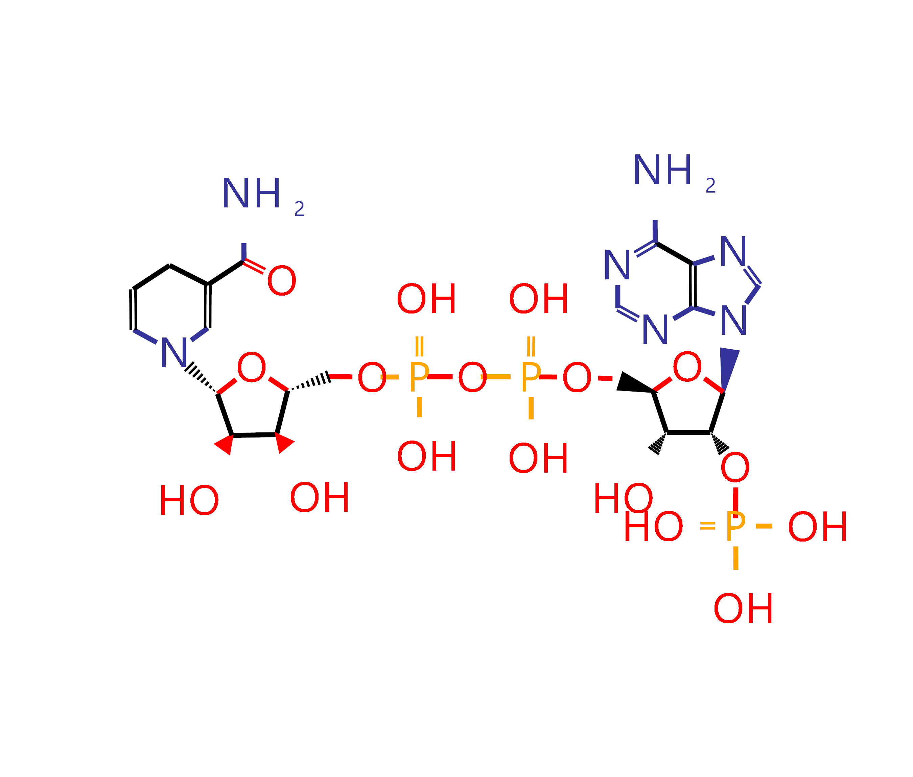

# KEGG.molDraw

Drawing chemical compound structures and glycan structures with capabilities to search against the KEGG databases


### Example

```vbnet
' Draw a NADPH molecule 2D structure in Extension pipline style.
Call IO _
    .LoadKCF("./DATA/NADPH.txt") _
    .Draw() _
    .Save("./DATA/NADPH.png")
```

